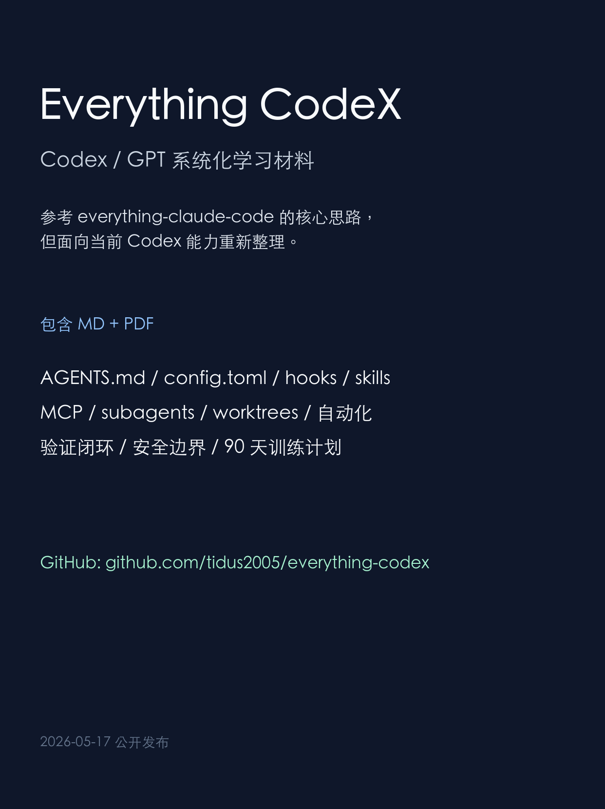

# Everything CodeX

一份面向 Codex / GPT 的系统化学习材料。

这份材料参考了 `everything-claude-code` 的核心思路，但不是 Claude Code 教程，也不是简单搬运。它把 agent harness 的方法论迁移到当前 Codex 体系下，重点覆盖:

- Codex App / CLI / IDE / Cloud / GitHub / Mobile 的能力分工
- GPT-5.5、GPT-5.4、GPT-5.3-Codex 的任务选择
- AGENTS.md、config.toml、rules、hooks、skills、MCP、subagents、worktrees
- Prompt、验证闭环、安全边界、自动化和 90 天训练计划
- 面向授课和团队推广的 Codex playbook

## 下载

- [Markdown 文档](docs/Everything-CodeX.md)
- [PDF 文档](docs/Everything-CodeX.pdf)

## 适合谁

- 想系统学习 Codex 的开发者
- 想把 Codex 用到真实工程流程里的技术负责人
- 想搭建团队 AI coding 工作流的人
- 想整理 Codex 课程、分享或内部培训的人

## 来源与说明

本文主要参考:

- [affaan-m/everything-claude-code](https://github.com/affaan-m/everything-claude-code)
- [OpenAI Codex documentation](https://developers.openai.com/codex)
- OpenAI Codex / GPT model、CLI、hooks、skills、subagents、security 等官方文档

如果你发现内容过时、表达不清或有更好的实践，欢迎提 issue 或 PR 一起交流。

## License

文档内容采用 [CC BY 4.0](LICENSE) 授权。
